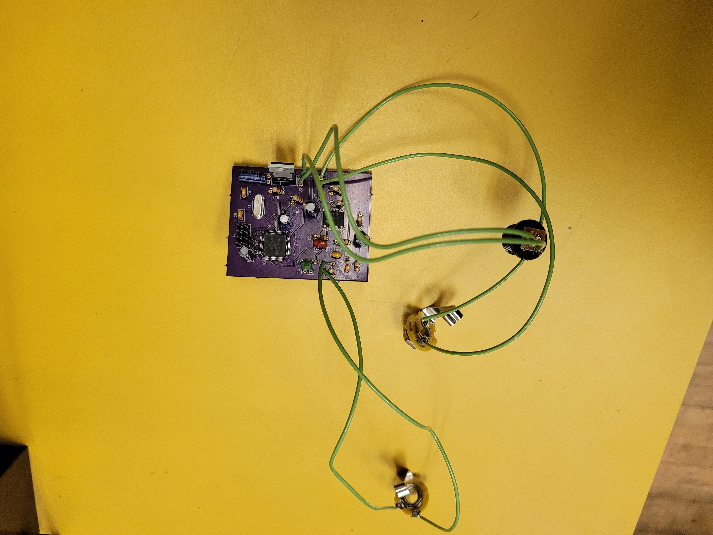

# Capstone-Project

## About
This is a pitch tracking guitar effect.
A guitar is connected through a bandpass filter into the microcontroller.
This signal is sampled and run through a fourier transform for pitch detection.
The pitch detected triggers an envelope for a square wave sound generator.
This is then summed with the original signal.

